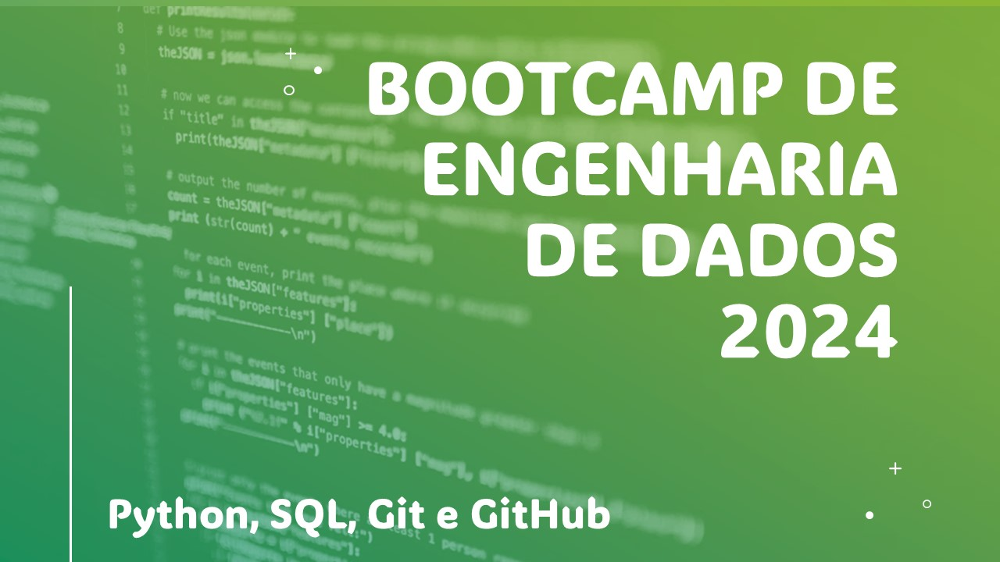

# Bootcamp Engenharia de dados 2024

**Data de inicio:** *19/02/2024*

**Resumo:**

Bootcamp com foco em desenvolvimento das habilidades de Python, SQL git e github para Engenharia de Dados.

Serão aproximadamente 40 aulas durante os meses de fevereiro, março e abril de 2024.

Os encontros ocorrem diariamente por volta de 1 hora para pratica de programação e desenvolvimento de ferramentas. 

**Objetivo:**

O objetivo é visitar ou revisitar conteudo destas tecnologias que auxiliem no dia a dia de trabalho com engenharia.
O foco é nas tecnologias descritas porém, vemos muito além. 

Irei adicionando mais informações neste doc conforme for avançando o botcamp.